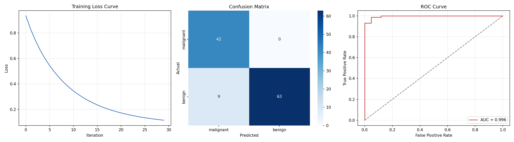

# Breast Cancer Classification using Neural Network

A neural network (Multi-Layer Perceptron) that classifies breast tumors as **malignant** or **benign** using the Wisconsin Diagnostic Breast Cancer dataset.

## 📊 Results

| Metric      | Score  |
|-------------|--------|
| Accuracy    | 92.1%  |
| Precision   | 100%   |
| Recall      | 87.5%  |
| F1-score    | 93.3%  |
| ROC-AUC     | 99.6%  |




```

## 🧠 About the Dataset

The [Wisconsin Diagnostic Breast Cancer dataset](https://scikit-learn.org/stable/datasets/toy_dataset.html#breast-cancer-dataset) is built into scikit-learn (no download needed):

- **569 samples**, **30 numeric features** (radius, texture, perimeter, area, smoothness, etc. of cell nuclei)
- **Binary target**: malignant (212 samples) / benign (357 samples)

## 🚀 Getting Started

### 1. Clone the repo
```bash
git clone https://github.com/<your-username>/breast-cancer-classification-nn.git
cd breast-cancer-classification-nn
```

### 2. Create a virtual environment (recommended)
```bash
python3 -m venv venv
source venv/bin/activate      # Windows: venv\Scripts\activate
```

### 3. Install dependencies
```bash
pip install -r requirements.txt
```

### 4. Run the script
```bash
python src/breast_cancer_nn.py
```

This will print training progress and evaluation metrics to the console, and save a results plot (loss curve, confusion matrix, ROC curve) to `results/breast_cancer_nn_results.png`.

### 5. (Optional) Launch the interactive web app
```bash
streamlit run app.py
```
This opens a browser-based demo where you can adjust feature sliders (or load a sample malignant/benign case) and get a live prediction with confidence score. You can also deploy this app for free on [Streamlit Community Cloud](https://streamlit.io/cloud) by pointing it at your GitHub repo and `app.py`.

## 🏗️ Model Architecture

- **Type**: Multi-Layer Perceptron (`sklearn.neural_network.MLPClassifier`)
- **Hidden layers**: 32 → 16 neurons
- **Activation**: ReLU
- **Optimizer**: Adam
- **Regularization**: L2 (alpha=1e-4) + early stopping
- **Preprocessing**: StandardScaler feature normalization

## 📈 Pipeline

1. Load data from scikit-learn
2. Stratified train/test split (80/20)
3. Standardize features (mean=0, std=1)
4. Train MLP with early stopping on a validation split
5. Evaluate on held-out test set (accuracy, precision, recall, F1, ROC-AUC)
6. Visualize training loss, confusion matrix, and ROC curve


